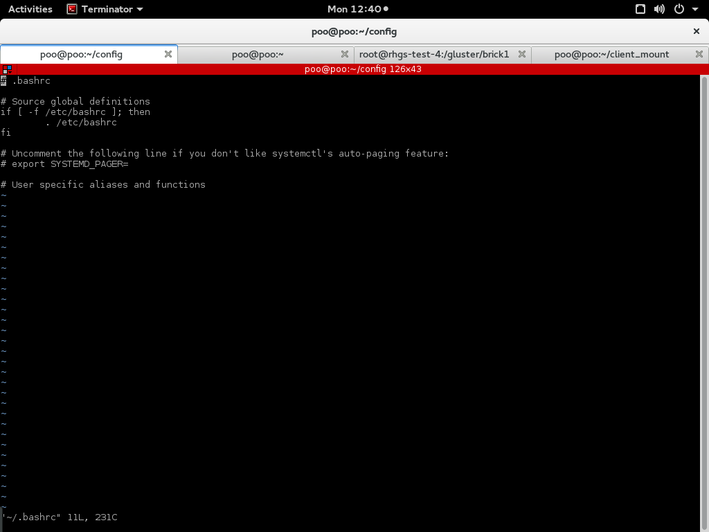

.. my_journal documentation master file, created by
   sphinx-quickstart on Wed Jun 22 17:38:31 2016.
   You can adapt this file completely to your liking, but it should at least
   contain the root `toctree` directive.

Welcome to my_journal's documentation!
======================================

This is a Title
===============
That has a paragraph about a main subject and is set when the '='
is at least the same length of the title itself.

Subject Subtitle
----------------
Subtitles are set with '-' and are required to have the same length 
of the subtitle itself, just like titles.

Lists can be unnumbered like:

 * Item Foo
 * Item Bar

Or automatically numbered:

 #. Item 1
 #. Item 2

Inline Markup
-------------
Words can have *emphasis in italics* or be **bold** and you can define
code samples with back quotes, like when you talk about a command: ``sudo`` 
gives you super user ```powers!```

This is an example how to link images:


Contents:

.. toctree::
   :maxdepth: 2
   
   introduction
   license
   contact
   kuch_bhi
   


Indices and tables
==================

* :ref:`genindex`
* :ref:`modindex`
* :ref:`search`

